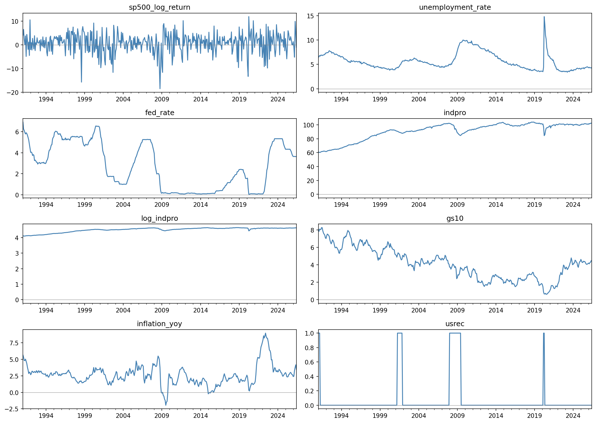
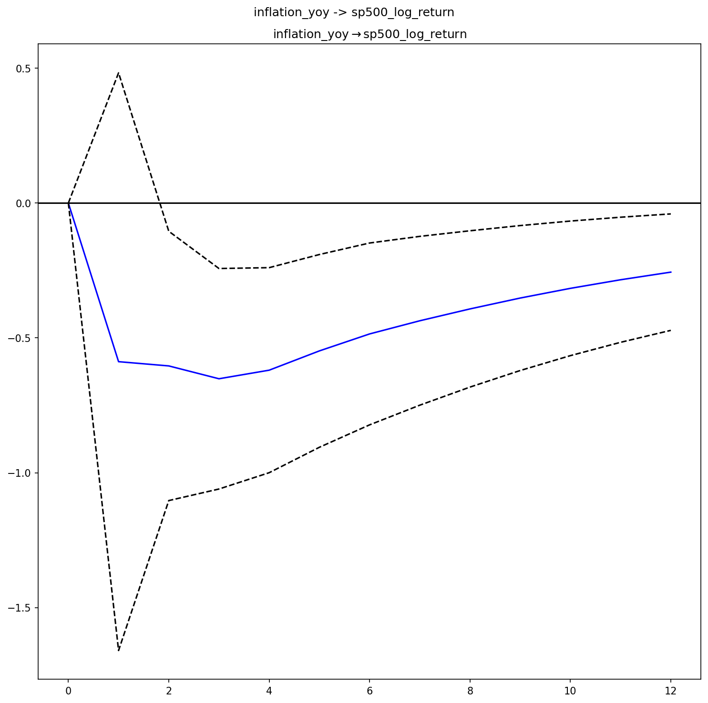
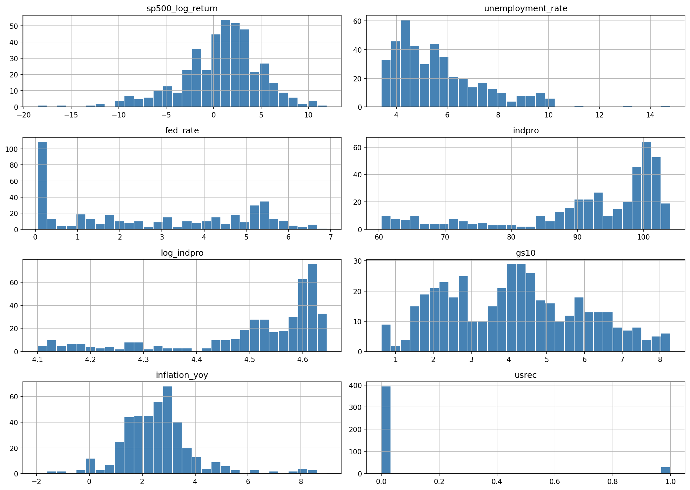
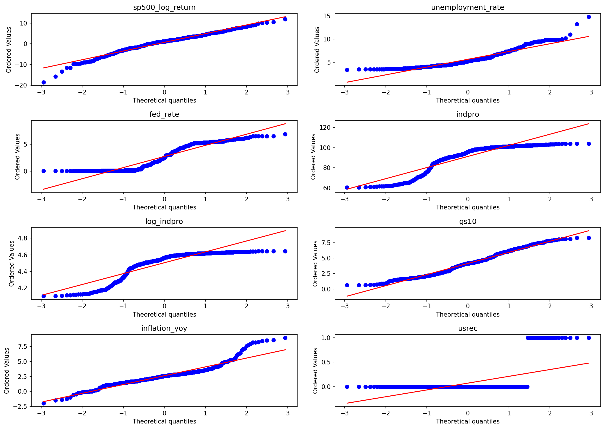

# S&P 500 Returns vs. U.S. Macroeconomic Indicators

An econometric analysis of how S&P 500 returns relate to unemployment, monetary policy, and inflation across U.S. economic cycles (1991–2026) — combining an OLS regression with regime-dependent effects and a Vector Autoregression (VAR) with Granger causality and impulse-response analysis.

## Motivation

This project started from a simple but puzzling observation: at several points in the recent U.S. economic cycle, the stock market has hit record highs while labor market momentum was clearly slowing. That contradiction (strong markets, weakening economy) is the empirical question this project investigates.

**Research question:** Does unemployment explain S&P 500 returns, and does that relationship change depending on the monetary policy regime and the economic cycle (recession vs. expansion)?

Rather than treating this as a single regression exercise, the project uses two complementary layers: an OLS model to test the conditional average relationship (including how it shifts during NBER-defined recessions), and a VAR model to relax the assumption that macro variables are exogenous — since the Fed itself reacts to market and labor conditions, not just influences them.

## Data

| Variable | Source | Series | Frequency |
|---|---|---|---|
| S&P 500 returns | Yahoo Finance (`yfinance`) | `^GSPC` | Monthly (log returns) |
| Unemployment rate | FRED | `UNRATE` | Monthly |
| Federal funds rate | FRED | `FEDFUNDS` | Monthly |
| Industrial production (GDP proxy) | FRED | `INDPRO` | Monthly |
| 10-year Treasury yield | FRED | `GS10` | Monthly |
| NBER recession indicator | FRED | `USREC` | Monthly |
| Inflation (YoY) | FRED | `CPIAUCSL`, transformed | Monthly |

**Sample:** January 1991 – June 2026 (426 monthly observations). The range starts in 1991 rather than 1990 because computing year-over-year inflation consumes the first 12 months of the raw series.

All data is pulled programmatically via `yfinance` and the FRED API (`fredapi`), not downloaded manually — the extraction pipeline is fully reproducible (see `01_data_extraction.ipynb`).

## Methodology

**Layer 1 — OLS regression.** Tests the average conditional relationship between unemployment changes and S&P 500 returns, controlling for the Fed funds rate, industrial production, the 10-year yield, and inflation, with an interaction term allowing the unemployment effect to differ during NBER-defined recessions. Diagnosed for heteroskedasticity (Breusch-Pagan), autocorrelation (Breusch-Godfrey), and multicollinearity (VIF); re-estimated with HC3 robust standard errors.

**Layer 2 — VAR / Granger causality / Impulse-response functions.** The OLS layer assumes the macro variables are exogenous — a strong assumption, since the Fed is known to react to market conditions ("Fed put"). The VAR treats all variables as potentially endogenous, without imposing a causal direction upfront. Granger causality tests then identify which variables actually predict which, and generalized impulse-response functions (IRF) trace the magnitude and duration of significant effects over a 12-month horizon.

All variables were tested for stationarity (ADF and KPSS) before modeling; non-stationary series were first-differenced (see `03_stationarity_tests.ipynb` for the full decision table).

## Key Findings

### 1. The OLS layer found a weak, statistically fragile relationship

R² = 3.2%, and no variable remained significant at the 5% level once heteroskedasticity-robust standard errors were applied. This is not a failure of the model — monthly equity returns are famously hard to explain with lagged macro fundamentals, consistent with weak-form market efficiency. It does mean a static, contemporaneous specification is the wrong tool for this question.

### 2. The market leads the economy — not the other way around

Granger causality tests show a strongly asymmetric pattern: S&P 500 returns significantly predict future changes in unemployment, the Fed funds rate, the 10-year yield, and inflation (p < 0.01 in all four cases). In the reverse direction, only inflation has significant predictive power over future S&P 500 returns — unemployment, the Fed funds rate, and the 10-year yield do not.

This also provides direct empirical evidence for the endogeneity assumption behind using a VAR: the Fed funds rate is itself significantly predicted by *past* S&P 500 returns and unemployment changes, confirming the Fed reacts to market and labor conditions rather than being a purely exogenous input.



### 3. Inflation's effect on the market is real, but delayed

The impulse-response function for inflation → S&P 500 returns shows no significant effect in the first month, but a significant *negative* effect emerges around month 2–3, peaks around month 3–4, and persists for roughly 8–9 months before fading.



This delayed pattern is consistent with Milton Friedman's "long and variable lags" principle: monetary and inflation shocks don't get priced in instantly — they take months to fully propagate. It also explains why the contemporaneous OLS model failed to detect this relationship robustly: the effect simply isn't contemporaneous.

### 4. The variables don't follow a normal distribution — and that's expected

None of the continuous variables passed the Jarque-Bera normality test, with S&P 500 returns showing the classic "fat left tail" of financial return series (crashes are more extreme than rallies), and unemployment/inflation showing right-skew tied to recession spikes.



Q-Q plots confirm the same pattern more precisely at the tails: `gs10` shows a bimodal distribution reflecting two distinct interest rate regimes across the sample (pre- and post-2008), while `unemployment_rate` and `inflation_yoy` curve sharply away from the reference line at their upper tail, consistent with the sharp spikes seen during recessions and the 2021–2023 inflation episode.



## Repository Structure

```
├── 01_data_extraction.ipynb       # Pull, clean, and transform the dataset
├── 02_exploratory_analysis.ipynb  # Descriptive stats, distributions, Q-Q plots
├── 03_stationarity_tests.ipynb    # Jarque-Bera, ADF, KPSS, first differencing
├── 04_ols_regression.ipynb        # Layer 1: OLS + interaction + diagnostics
├── 05_var_irf_analysis.ipynb      # Layer 2: VAR, Granger causality, IRF
├── images/                        # Exported figures used in this README
├── sp500_macro_monthly_1990_2026.csv
├── requirements.txt
└── README.md
```

## Reproducing This Analysis

```bash
git clone <repo-url>
cd sp500-macro-analysis
pip install -r requirements.txt
```

You'll need a free FRED API key (get one at [fred.stlouisfed.org](https://fred.stlouisfed.org/docs/api/api_key.html)), stored in a `.env` file as `FRED_API_KEY=your_key_here`. Run the notebooks in order, 01 through 05.

## Limitations & Next Steps

- The OLS layer's interaction term (unemployment × recession) did not reach conventional significance, even though its sign was consistent with the initial hypothesis — the result is suggestive, not conclusive.
- The VAR system is limited to 5 variables to preserve degrees of freedom; industrial production was excluded from this layer and retained only as an OLS control.
- A natural extension would be a Markov-switching model to formally test for regime-dependent effects, rather than relying on a single interaction term.
- The relationship analysis (unemployment * recession) could be conducted focusing periods post-recessions, where monetary policy regimes aims to improve macroeconomic variables through quatitative easing programs. 

## About

Built as part of a transition into data analysis, combining a background in economics, financial markets, and econometrics with hands-on Python implementation. Feedback welcome — feel free to open an issue or reach out on [LinkedIn](#).
